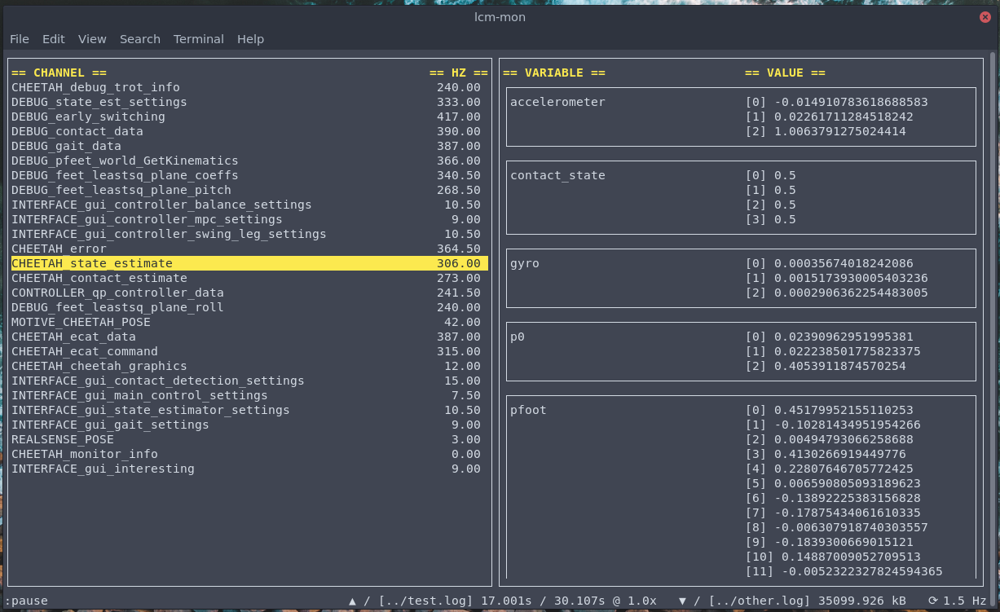

# lcm-mon

`lcm-mon` is a command-line monitor program for the Lightweight Communications and Marshalling library, LCM. `lcm-mon` is intended for monitoring, debugging, and visualization purposes in robotics applications, and supports features such as previewing messages, reading and writing logs, and graphing message data. It has a `vim`-style minimalist interface that is powerful when needed.

## Preview



## Installation

`lcm-mon` can be installed using the `setup.py` file:

```
sudo python3 setup.py install
```

`lcm-mon` runs on Python 3, and the following libraries need to be present on the system:

* `urwid` -- for command-line UI
* `lcm` -- communication (build LCM with Python 3 bindings enabled)
* `matplotlib` -- for visualization
* `numpy` -- also for visualization

## Documentation

### Commands

The following commands are supported:

* `:q[uit]` -- Quit `lcm-mon`.
* `:l[og] [filepath]` -- Start or stop logging. If `filepath` is given, it logs to that file. Otherwise, it chooses a random filename in the current directory. Running `:l[og]` when `lcm-mon` is already logging stops logging and dumps the file.
* `:p[lay] <filepath> [speed]` -- Play the log at `filepath`. If `speed` is given, it plays it back at that speed (default is `1.0`).
* `:p[lay] <speed>` -- If `lcm-mon` has loaded a log to play (either currently playing or paused), set its playback speed to `speed`.
* `:p[ause]` -- Pause playback of the currently loaded log.
* `:p[lay]` -- Resume playback of the currently loaded log.
* `s[eek] <position>` -- Seek to a particular position (in seconds) in a log loaded for playing. If `position` is specified as `+<value>` or `-<value>`, jump relative to the current position in the log; if `position` is specified as `<value>`, jump to that absolute position in the log.
* `:r[efresh] <rate>` -- Set the refresh rate (in Hz) of the displays and graphs to `rate` (default is `1.5`)
* `:v[iew]` -- Graph the currently selected variable on a time-series plot. Multiple variables can be plotted by running `:v` on each variable to plot, and already plotted variables can be toggled and removed from the plot by running `:v` again.
* `:v[iew] -` -- Stop plotting all variables currently being plotted.
* `:c[lear]` -- Clear the display of all channels and variables.

### Command-line arguments

Calling `lcm-mon` from the command line takes the following form:

```
lcm-mon [options]
```

The following options are supported:

* `-h`, `--help` -- Show a help message and exit
* `-u <lcm_url`, `--url=<lcm_url>` -- Use `lcm_url` as the LCM URL. If this option is not given, the `LCM_DEFAULT_URL` environmental variable is used. If that environmental variable is also not set, then the internal default LCM URL of `"udpm://239.255.76.67:7667?ttl=1"` is used.
* `-f <filter_regex>`, `filter=<filter_regex>` -- Filter channels that are subscribed to by using a regex. The default is to subscribe to all channels on the network, or the regex `".*"`.
* `-t <types_dir>`, `--types=<types_dir>` -- Location of a directory containing `.lcm` types files, used to inspect variables inside individual LCM messages. `lcm-mon` recursively finds all `.lcm` files in this directory and compiles them itself to load all type definitions. Multiple directories can also be specified as space-separated values with this option. The default is to not load any type definitions. Note that `lcm-mon` will still be able to capture messages without knowing their types, but any messages that can't be decoded will be shown as blank on the right-hand panel.
* `-c <config_file>`, `--config=<config_file>` -- Location of the configuration file to specify personal preferences. The default configuration file location is at `~/.config/lcm-mon/config.json`. Structure of this JSON file is described in the "Configuration" section below.

### Configuration

By default, the configuration is read as a JSON file from `~/.config/lcm-mon/config.json` (a different file can be loaded with the `-c` command-line argument). When `lcm-mon` is installed, a default configuration file is written to `/etc/lcm-mon/config.json`, but this is not read -- to activate your configuration, copy it over to the default search location of `~/.config/lcm-mon/config.json` and edit it there. If a configuration file is not found, certain default values of variables are used.

Currently, the following preference variables are supported:

* `"highlight_color"` -- Color of the headers and selected entries (default is `"yellow"`). The possible values are given [here](http://urwid.org/manual/displayattributes.html#standard-foreground-colors).
* `"default_refresh_rate"` -- Rate at which tables and graphs are refreshed, in Hz (default is `1.5`). This can also be altered during operation with the `:refresh` command.
